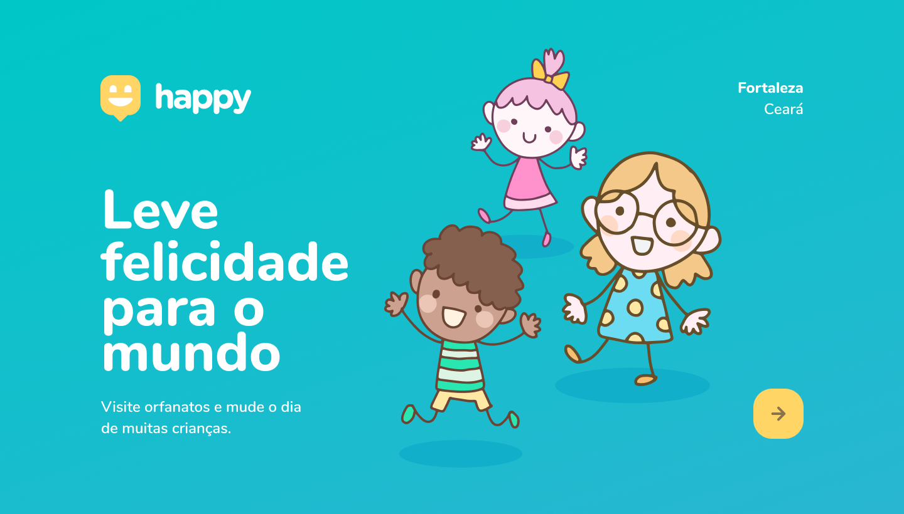

<h1 align="center">NextLevelWeek 03 🚀 </h1>
<h3 align="center">[🚧  Em construção...  🚧]</h3>

  <a href="#-projeto">Projeto</a>&nbsp;&nbsp;&nbsp;|&nbsp;&nbsp;&nbsp;
  <a href="#-Cronograma">Cronograma</a>&nbsp;&nbsp;&nbsp;|&nbsp;&nbsp;&nbsp;
  <a href="#-Tecnologias">Tecnologias </a>&nbsp;&nbsp;&nbsp;|&nbsp;&nbsp;&nbsp;
  <a href="#-layout">Layout</a>&nbsp;&nbsp;&nbsp;|&nbsp;&nbsp;&nbsp;
  <a href="#-Autora">Autora</a>&nbsp;&nbsp;&nbsp;|&nbsp;&nbsp;&nbsp;
  <a href="#-Licença">Licença</a>

 

## 💻 Sobre o projeto

Happy - é um projeto desenvolvido durante a **NLW - Next Level Week**, da [Rocketseat](https://rocketseat.com.br/) do dia 12 a 18 de outubro de 2020. Sendo uma experiência totalmente online e gratuita por uma semana, com explicações do conteúdo e mão na massa.    
O objetivo do projeto é presta assistência a orfanatos, que tenha crianças que se encontre em qualidade e/ou situação vunerável na social. Conectar e insentivar as pessoas visitarem um orfanato perto delas, e fazer as crianças felizes.   
"Leve felicidade para o mundo!" 😊 Rocketseat.
  

## 📅 Cronograma
<input type="checkbox" disabled/> 1º Dia: Acelerando sua evolução 12/10  - :heavy_check_mark:  
<input type="checkbox" disabled/> 2º Dia: Olhando as oportunidades 13/10  -  🚧 
<input type="checkbox" disabled/> 3º Dia: A escolha da Stack 14/10  -  🚧 
<input type="checkbox" disabled/> 4º Dia: Até 2 anos em 2 meses 15/10  -  🚧 
<input type="checkbox" disabled/> 5º Dia: Milha extra 16/10  -  🚧   

 

## 🚀 Tecnologias

- [JavaScript]
- [HTML5]
- [CSS3]

 

## 🎨 Layout

### home

<h2 align="center">
    
</h2>
 

Para mais detalhes do layout, é só acessar [Figma](https://www.figma.com/file/vphQV4U3HWLCMbt6Vmylob/Happy-Web-(Copy)?node-id=0%3A1).

 

## 💪 Como contribuir no projeto
Faça um fork do projeto.
Crie uma nova branch com as suas alterações: git checkout -b my-feature
Salve as alterações e crie uma mensagem de commit contando o que você fez: git commit -m "feature: Minha contribuição"
Envie as suas alterações: git push origin my-feature

 

## Autora
 

 

📝<b>Naka</b></a> 

 
 

## 📝 Licença

MIT license [LICENSE](/LICENSE).
